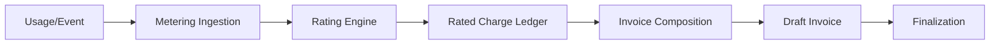

# Billing and Payment Architecture

This document describes the unified billing foundation that handles Pay-As-You-Go (PAYG), monthly subscriptions, and usage-based quotas across the platform.

## Overview

The billing system is designed to support three primary pricing modes under a single monthly invoice:
- **App Hosting (PAYG)**: Hourly charges with a monthly maximum cap.
- **VPN / Flat Rate**: Standard monthly recurring subscriptions.
- **Add-ons / Hybrid**: Combination of recurring base fees and usage-based meters.

---

## Current Implementation Status

| Feature | Status | Details |
| :--- | :--- | :--- |
| **Data Models** | ✅ Implemented | Full Prisma schema for Accounts, Subscriptions, Meters, UsageEvents, RatedUsage, and Invoices. |
| **Invoices UI** | ✅ Implemented | Complete interface for listing, viewing details, and downloading PDF invoices. |
| **Deploy Pricing UI** | ✅ Implemented | Pay-As-You-Go selector with CPU/Memory configuration in the deployment wizard. |
| **WhatsApp Quota** | ✅ Implemented | Functional quota service for real-time message deduction and monthly usage tracking. |
| **Rating Engine** | 🚧 Pending | The engine to transform raw `UsageEvent` into `RatedUsage` (including capping logic) is in progress. |
| **Metering Ingestion** | 🚧 Pending | Automated ingestion of app runtime hours from clusters. |
| **Auto-Invoicing** | 🚧 Pending | Automated end-of-month `BillingRun` to aggregate rated usage into final invoices. |

---

## Billing Modes & Use Cases

### 1. Pay-As-You-Go (Hourly Capped)
**Primary Use Case:** App Hosting.
- **Charge Driver:** `runtime_hours` (metered).
- **Pricing:** `hourlyRate * billableHours`.
- **The Cap Rule:** Total hourly charges for a single app in a calendar month will never exceed its defined `monthlyCap`. Once the cap is hit, additional hours are rated at $0.

### 2. Monthly Flat Rate
**Primary Use Case:** VPN Service or Pro Plan.
- **Charge Driver:** Active subscription.
- **Pricing:** Fixed amount per month.
- **Rule:** Billed at the start of the billing period. Mid-cycle changes take effect in the next cycle (Phase 1).

### 3. Usage Quotas (Prepaid/Allotted)
**Primary Use Case:** WhatsApp Messaging.
- **Mechanism:** Deducts from a monthly allotment (e.g., 1000 messages/month).
- **Logic:** Real-time transactional checks using `deductQuota()` in `quota.service.ts`.

---

## The Billing Lifecycle

1. **Ingestion**: Raw events (e.g., "app-runtime: 1 hour") are persisted with a mandatory `idempotencyKey` to prevent double-billing.
2. **Rating**: The engine looks up the `MeterPrice` and converts quantity to currency. This is where **Capping** is applied.
3. **Composition**: All `RatedUsage` for a `BillingAccount` are grouped into a single draft invoice for the month.
4. **Finalization**: At month-end, the draft is locked, an invoice number is assigned, and it becomes immutable.

---

## How to Evaluate

To evaluate the current progress and data structure:

1. **Database Schema**: Review `prisma/schema.prisma` under the "Billing" section to see the canonical models.
2. **UI Flow**: Navigate to `/console/app/deploy` and progress to the **Environment Settings** step to use the Pay-As-You-Go resource selector.
3. **Invoice Management**: Access `/portal/invoices` (as an owner/admin) to view the invoice list and detail pages.
4. **WhatsApp Quota**: Examine `modules/whatsapp/messages/quota.service.ts` to see how real-time usage deduction is implemented today.
5. **Architecture ADR**: For the long-term vision and technical decisions, refer to `docs/billing-foundation-architecture-adr.md`.

---

## Future Roadmap

- **Phase 2**: Implement the background worker for the Rating Engine.
- **Phase 3**: Integration with payment gateways (Stripe/WorkOS) for automated collection.
- **Phase 4**: Advanced tax handling and jurisdictional discounts.
