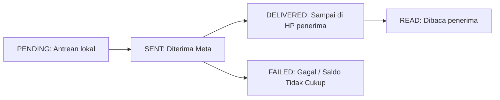

# Pengiriman Pesan WhatsApp, Live Chat & Pelacakan Status

Menu **Messages** (`/console/whatsapp/messages`) menyediakan antarmuka terpadu untuk pengiriman pesan manual, obrolan live chat dengan pelanggan, dan pemantauan status pengiriman pesan secara real-time.

---

## 1. Langkah Pengiriman Pesan Template

1. Pilih **Perangkat Pengirim** (nomor WhatsApp) pada bagian atas halaman.
2. Masukkan **Nomor Telepon Tujuan** dalam format internasional E.164 (contoh: `+6281234567890`).
3. Pilih template pesan yang sudah disetujui dari daftar dropdown template.
4. Isi data pada setiap parameter variabel dinamis yang tersedia (`{{1}}`, `{{2}}`).
5. Klik tombol **Kirim Pesan** untuk memproses pengiriman melalui Meta Cloud API.

---

## 2. Siklus Status Pengiriman Pesan

Setiap pesan akan melewati tahapan status yang terdefinisi dengan jelas:

- **PENDING**: Pesan sedang dalam antrean pengiriman (*queue worker*).
- **SENT**: Pesan berhasil diterima oleh server Meta Cloud API (centang satu abu-abu).
- **DELIVERED**: Pesan telah berhasil sampai di perangkat penerima (centang dua abu-abu).
- **READ**: Pesan telah dibuka dan dibaca oleh penerima (centang dua biru).
- **FAILED**: Pengiriman gagal (misalnya nomor tidak terdaftar di WhatsApp atau saldo kuota tidak mencukupi).

---

## 3. Pelacakan & Log Pengiriman

- **Webhook Logs (`/console/whatsapp/webhook-logs`)**: Tinjau callback status pengiriman pesan dari Meta beserta rincian waktunya.
- **Audit Logs (`/console/whatsapp/audit-logs`)**: Telusuri jejak audit pengguna yang memicu pengiriman pesan dan mutasi saldo yang tercatat.
