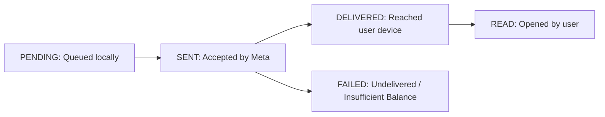

# WhatsApp Message Dispatch, Live Chat & Lifecycle Tracking

The **Messages** console (`/console/whatsapp/messages`) provides a unified workspace for manual message dispatch, customer support live chat, and delivery tracking.

---

## 1. Sending a Template Message (Step-by-Step)

1. Select the **Sender Device** (phone number) from the top-left device dropdown.
2. Enter the destination **Recipient Phone Number** in international E.164 format (e.g. `+6281234567890`).
3. Select an approved template from the **Template Selector**.
4. Input values for all required dynamic parameters (`{{1}}`, `{{2}}`).
5. Click **Send Message** to dispatch the message via Meta Cloud API.

---

## 2. Message Lifecycle & Status Progression

Every message moves through well-defined lifecycle stages:

- **PENDING**: Enqueued in the message dispatch worker.
- **SENT**: Successfully accepted by Meta Cloud API.
- **DELIVERED**: Successfully delivered to the recipient's device (double gray checkmark).
- **READ**: Opened and viewed by recipient (double blue checkmark).
- **FAILED**: Rejected by Meta (e.g., number not registered on WhatsApp or insufficient organization quota).

---

## 3. Auditing & Webhook Tracking

- **Webhook Logs (`/console/whatsapp/webhook-logs`)**: View inbound delivery receipts, timestamps, and error codes.
- **Audit Logs (`/console/whatsapp/audit-logs`)**: Review user attribution and financial ledger debit entries associated with the message.
