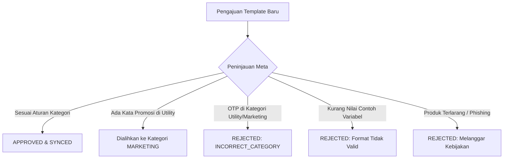

# Panduan Template Pesan & Persetujuan Meta

Template Pesan WhatsApp memungkinkan bisnis mengirim notifikasi proaktif, pembaruan status pesanan, kode verifikasi OTP, hingga siaran promosi ke pelanggan. Karena WhatsApp menjaga kenyamanan kotak masuk pengguna, **seluruh template wajib disetujui resmi oleh Meta** sebelum dapat dikirim.

---

## 1. Panduan Cepat: Buat Template Pertama dalam 3 Langkah

Anda dapat merancang, mengajukan, dan memantau status template langsung dari **Console**:

1. **Buka Builder Template**: Masuk ke menu **Console** > **WhatsApp** > **Templates** (`/console/whatsapp/templates`) dan klik tombol **"Buat Template"**.
2. **Atur Konten Template**:
   - Tentukan **Nama Template** (contoh: `notifikasi_pengiriman_pesanan`), pilih **Kategori** (`UTILITY`), dan tentukan **Bahasa**.
   - Tulis isi pesan dengan placeholder variabel `{{1}}`, `{{2}}` untuk data dinamis pelanggan.
   - Isi **Nilai Contoh (_Sample Values_)** yang realistis (contoh: `Budi`, `INV-12345`) agar peninjau otomatis Meta memahami konteks pesan Anda.
   - Tambahkan tombol opsional seperti **Quick Reply** atau **Call-to-Action** (_"Cek Resi"_ atau _"Salin Kode"_).
3. **Ajukan & Sinkronisasi**: Klik **Submit**. Meta biasanya meninjau template dalam hitungan detik hingga beberapa menit. Setelah disetujui, klik **"Sinkronisasi Template"** untuk memperbarui status di dasbor Anda.

---

## 2. Kategori Template & Contoh Visual

Meta membagi setiap template ke dalam salah satu dari tiga kategori utama. Pilih kategori yang sesuai dengan tujuan utama pesan Anda:

| Kategori             | Cocok Untuk                                                            | Pengali Kuota | Aturan Utama                                                            |
| :------------------- | :--------------------------------------------------------------------- | :------------ | :---------------------------------------------------------------------- |
| **`UTILITY`**        | Resi pengiriman, konfirmasi pesanan, invoice tagihan, pengingat jadwal | **1.0x**      | Dilarang mencantumkan kata promosi, diskon, atau upsell.                |
| **`AUTHENTICATION`** | Kode OTP login & verifikasi keamanan akun                              | **1.5x**      | Wajib hanya berisi kode OTP & peringatan keamanan. Tanpa salam promosi. |
| **`MARKETING`**      | Promosi diskon, peluncuran produk, pesan sambutan, cart recovery       | **2.0x**      | Mengizinkan header gambar, emoji, dan link belanja eksternal.           |

> 💡 **Informasi Tarif & Harga Real-Time:**
> Rincian tarif per pesan aktual untuk setiap negara tujuan dan mata uang dikelola secara dinamis. Lihat daftar harga resmi terkini langsung di [**Tabel Harga WhatsApp**](/console/whatsapp/pricing).

---

### A. Template Utility (Notifikasi Transaksi)

_Tujuan:_ Memberikan informasi status transaksi atau akun yang secara spesifik diminta oleh pelanggan.

> 📦 **Pembaruan Pengiriman Pesanan**
>
> Halo **{{1}}**, pesanan Anda dengan nomor **#{{2}}** telah dikirim melalui kurir **{{3}}**.  
> **Nomor Resi:** {{4}}  
> **Estimasi Tiba:** {{5}}.  
> Terima kasih telah berbelanja di toko kami.
>
> _Logistik PFNApp_  
> `[🔘 Quick Reply: Cek Status Resi]`

---

### B. Template Autentikasi (Format Baku / Predefined Meta OTP)

_Tujuan:_ Mengirimkan kode verifikasi identitas dan keamanan akun sekali pakai (OTP).

> ⚠️ **Ketentuan Baku Resmi Meta:**  
> Sesuai aturan resmi Meta WhatsApp Business API, **isi kalimat (body text) template Autentikasi tidak dapat dikustomisasi dengan kalimat bebas**. Meta mewajibkan teks standar yang telah ditentukan secara baku dan hanya memperbolehkan tipe tombol khusus:
>
> 1. **Tombol Salin Kode (_Copy Code_)**: Menambahkan tombol sekali klik untuk menyalin OTP ke clipboard (`[📋 Copy Code]`).
> 2. **Tombol Satu Ketuk / Autofill Aplikasi Android (_One-Tap Autofill_)**: Menghubungkan verifikasi langsung ke aplikasi Android Anda.

> 🔐 **Pesan Autentikasi Baku**
>
> **{{1}}** adalah kode verifikasi Anda.  
> Demi keamanan, jangan berikan kode ini kepada siapa pun.  
> Berlaku selama **{{2}}** menit.
>
> _Peringatan Keamanan_  
> `[📋 Copy Code]` &nbsp; `[⚡ Autofill Aplikasi Android]`

> 🎉 **Promo Spesial Gajian**
>
> 🎉 Halo **{{1}}**, Promo Spesial Gajian telah dimulai!  
> Dapatkan diskon hingga **{{2}}% OFF** untuk seluruh paket cloud hosting dan add-on WhatsApp API dengan kode voucher **{{3}}**.  
> Penawaran berlaku hingga **{{4}}**. Jangan sampai terlewat!
>
> _Syarat & ketentuan berlaku._  
> `[🔗 Ambil Diskon Sekarang]` &nbsp; `[🔘 Berhenti Menerima Promo]`

---

## 3. Aturan Pre-Review Meta & Asisten Klasifikasi Otomatis

Untuk mencegah penolakan tiba-tiba dari Meta, **Console Template Builder** dilengkapi dengan mesin validasi aturan cerdas yang mengevaluasi teks secara real-time:

| Pola Kata Kunci / Format | Maksud Terdeteksi | Panduan & Rekomendasi Kategori Otomatis |
| :--- | :--- | :--- |
| **`otp`, `kode verifikasi`, `kode keamanan`, `verification code`** | Autentikasi | **Peringatan:** Meta mewajibkan kategori **`AUTHENTICATION`** dengan format preset resmi. Kategori Utility/Marketing akan ditolak (`INCORRECT_CATEGORY`). |
| **`promo`, `diskon`, `voucher`, `cashback`, `sale`, `flash sale`** | Promosi di Utility | **Peringatan:** Menyertakan kata promosi/diskon pada kategori **`UTILITY`** akan memicu penolakan Meta atau reklasifikasi paksa ke **`MARKETING`**. |
| **`{{1}}` di akhir teks** | Pelanggaran Boundary | **Peringatan:** WhatsApp membatasi variabel mengambang di akhir kalimat. Tambahkan tanda baca atau teks penutup setelah placeholder. |
| **Variabel bertumpuk `{{1}}{{2}}`** | Format Tidak Valid | **Error:** Meta menolak variabel berdampingan tanpa spasi atau kata pemisah. |

---

## 4. Penyebab Template Ditolak Meta (dan Solusinya)

Meta meninjau pengajuan template menggunakan sistem AI dan auditor manual. Jika template Anda ditolak atau dialihkan kategorinya, periksa penyebab umum berikut:

### 1. Memasukkan Kata Promosi pada Template Utility

- **Penyebab**: Mengajukan template sebagai `UTILITY` padahal mengandung kata seperti _"diskon"_, _"coba gratis"_, _"rekomendasi produk"_, _"cashback"_, _"voucher"_, atau tautan landing page promosi.
- **Tindakan Meta**: Ditolak langsung atau otomatis diubah menjadi `MARKETING`.
- **Solusi**: Jaga pesan utility tetap faktual murni transaksi, atau ajukan sejak awal sebagai `MARKETING`.

### 2. Mengirimkan Kode OTP pada Kategori Utility / Marketing

- **Penyebab**: Mengajukan pesan kode verifikasi login / OTP secara kustom dengan kategori `UTILITY`.
- **Tindakan Meta**: Ditolak otomatis oleh Meta dengan status `INCORRECT_CATEGORY`.
- **Solusi**: Ubah kategori template menjadi `AUTHENTICATION` dan manfaatkan template preset Meta yang dilengkapi tombol 1-tap Copy Code.

### 3. Tidak Mengisi Contoh Nilai Variabel (_Sample Values_)

- **Penyebab**: Menggunakan variabel `{{1}}`, `{{2}}` tanpa mengisi kolom contoh teks kalimat di formulir builder.
- **Tindakan Meta**: Ditolak karena sistem review tidak dapat memahami konteks kalimat.
- **Solusi**: Selalu isi contoh nilai variabel yang realistis (contoh: `Budi`, `INV-12345`) saat pembuatan template.

### 4. Variabel Menggantung Tanpa Konteks

- **Penyebab**: Menaruh variabel berurutan tanpa kalimat penjelas (contoh: `Kode Anda adalah {{1}} {{2}} {{3}}`).
- **Solusi**: Beri penjelasan fungsi setiap variabel: `Kode aktivasi Anda adalah {{1}}. Berlaku selama {{2}} menit.`

---

## 5. Indikator yang Mengubah Template Menjadi "Marketing"

Meta akan otomatis menganggap template sebagai **`MARKETING`** jika terdapat **salah satu** indikator berikut:

1. **Penawaran Diskon & Upsell**: Menyebut promo, diskon, cashback, atau penawaran produk tambahan (_"Ingin upgrade ke paket Pro?"_).
2. **Pesan Sambutan Promotif**: Pesan pembuka yang mengarahkan pengguna melihat-lihat katalog toko.
3. **Permintaan Ulasan & Kuesioner**: Meminta rating bintang 5 atau review Google Maps setelah transaksi selesai (_"Bagaimana pesanan Anda? Berikan ulasan di sini!"_).
4. **Aturan Konten Campuran (_Mixed Content Rule_)**: Jika pesan berisi **90% konfirmasi pesanan** tetapi terselip **10% penawaran voucher**, Meta **selalu mengkategorikan seluruh template tersebut sebagai MARKETING**.
