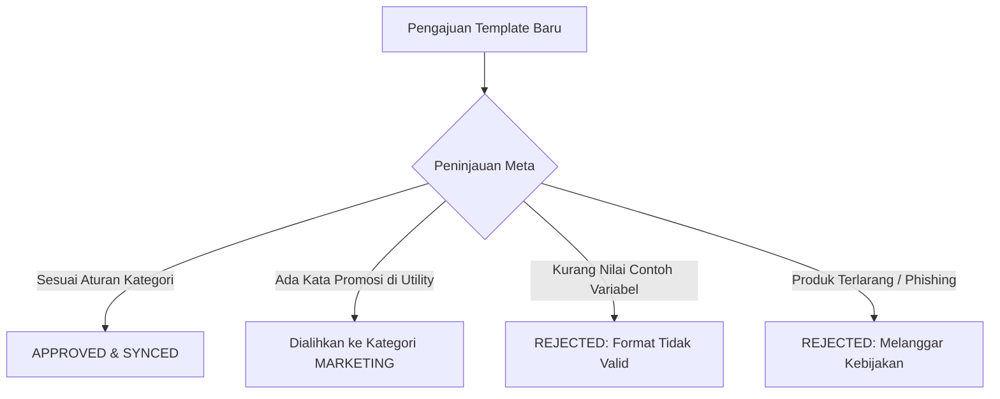

# Panduan Template Pesan & Persetujuan Meta

Template Pesan WhatsApp memungkinkan bisnis mengirim notifikasi proaktif, pembaruan status pesanan, kode verifikasi OTP, hingga siaran promosi ke pelanggan. Karena WhatsApp menjaga kenyamanan kotak masuk pengguna, **seluruh template wajib disetujui resmi oleh Meta** sebelum dapat dikirim.

---

## 1. Panduan Cepat: Buat Template Pertama dalam 3 Langkah

Anda dapat merancang, mengajukan, dan memantau status template langsung dari **Console**:

1. **Buka Builder Template**: Masuk ke menu **Console** > **WhatsApp** > **Templates** (`/console/whatsapp/templates`) dan klik tombol **"Buat Template"**.
2. **Atur Konten Template**:
   - Tentukan **Nama Template** (contoh: `notifikasi_pengiriman_pesanan`), pilih **Kategori** (`UTILITY`), dan tentukan **Bahasa**.
   - Tulis isi pesan dengan placeholder variabel `{{1}}`, `{{2}}` untuk data dinamis pelanggan.
   - Isi **Nilai Contoh (*Sample Values*)** yang realistis (contoh: `Budi`, `INV-12345`) agar peninjau otomatis Meta memahami konteks pesan Anda.
   - Tambahkan tombol opsional seperti **Quick Reply** atau **Call-to-Action** (*"Cek Resi"* atau *"Salin Kode"*).
3. **Ajukan & Sinkronisasi**: Klik **Submit**. Meta biasanya meninjau template dalam hitungan detik hingga beberapa menit. Setelah disetujui, klik **"Sinkronisasi Template"** untuk memperbarui status di dasbor Anda.

---

## 2. Kategori Template & Contoh Visual

Meta membagi setiap template ke dalam salah satu dari tiga kategori utama. Pilih kategori yang sesuai dengan tujuan utama pesan Anda:

| Kategori | Cocok Untuk | Pengali Kuota | Aturan Utama |
| :--- | :--- | :--- | :--- |
| **`UTILITY`** | Resi pengiriman, konfirmasi pesanan, invoice tagihan, pengingat jadwal | **1.0x** | Dilarang mencantumkan kata promosi, diskon, atau upsell. |
| **`AUTHENTICATION`** | Kode OTP login & verifikasi keamanan akun | **1.5x** | Wajib hanya berisi kode OTP & peringatan keamanan. Tanpa salam promosi. |
| **`MARKETING`** | Promosi diskon, peluncuran produk, pesan sambutan, cart recovery | **2.0x** | Mengizinkan header gambar, emoji, dan link belanja eksternal. |

> 💡 **Informasi Tarif & Harga Real-Time:**
> Rincian tarif per pesan aktual untuk setiap negara tujuan dan mata uang dikelola secara dinamis. Lihat daftar harga resmi terkini langsung di [**Tabel Harga WhatsApp**](/console/whatsapp/pricing).

---

### A. Template Utility (Notifikasi Transaksi)
*Tujuan:* Memberikan informasi status transaksi atau akun yang secara spesifik diminta oleh pelanggan.

> 📦 **Pembaruan Pengiriman Pesanan**
>
> Halo **{{1}}**, pesanan Anda dengan nomor **#{{2}}** telah dikirim melalui kurir **{{3}}**.  
> **Nomor Resi:** {{4}}  
> **Estimasi Tiba:** {{5}}.  
> Terima kasih telah berbelanja di toko kami.  
> 
> *Logistik PFNApp*  
> `[🔘 Quick Reply: Cek Status Resi]`

---

### B. Template Autentikasi (OTP & Verifikasi)
*Tujuan:* Mengirimkan kode verifikasi identitas dan keamanan akun sekali pakai (OTP).

> 🔐 **Verifikasi Keamanan Akun**
>
> **{{1}}** adalah kode verifikasi akun PFNApp Anda.  
> Demi keamanan, jangan berikan kode ini kepada siapa pun.  
> Kode berlaku selama **{{2}}** menit.  
>
> *Peringatan Keamanan*  
> `[📋 Copy Code]` &nbsp; `[🔗 Verifikasi Login]`

---

### C. Template Marketing (Siaran Pesan Promosi)
*Tujuan:* Meningkatkan transaksi belanja, mengumumkan produk baru, atau memberikan penawaran diskon khusus.

> 🎉 **Promo Spesial Gajian**
>
> 🎉 Halo **{{1}}**, Promo Spesial Gajian telah dimulai!  
> Dapatkan diskon hingga **{{2}}% OFF** untuk seluruh paket cloud hosting dan add-on WhatsApp API dengan kode voucher **{{3}}**.  
> Penawaran berlaku hingga **{{4}}**. Jangan sampai terlewat!  
>
> *Syarat & ketentuan berlaku.*  
> `[🔗 Ambil Diskon Sekarang]` &nbsp; `[🔘 Berhenti Menerima Promo]`

---

## 3. Penyebab Template Ditolak Meta (dan Solusinya)

Meta meninjau pengajuan template menggunakan sistem AI dan auditor manual. Jika template Anda ditolak atau dialihkan kategorinya, periksa 4 penyebab umum berikut:

### 1. Memasukkan Kata Promosi pada Template Utility
- **Penyebab**: Mengajukan template sebagai `UTILITY` padahal mengandung kata seperti *"diskon"*, *"coba gratis"*, *"rekomendasi produk"*, *"cashback"*, *"voucher"*, atau tautan landing page promosi.
- **Tindakan Meta**: Ditolak langsung atau otomatis diubah menjadi `MARKETING`.
- **Solusi**: Jaga pesan utility tetap faktual murni transaksi, atau ajukan sejak awal sebagai `MARKETING`.

### 2. Tidak Mengisi Contoh Nilai Variabel (*Sample Values*)
- **Penyebab**: Menggunakan variabel `{{1}}`, `{{2}}` tanpa mengisi kolom contoh teks kalimat di formulir builder.
- **Tindakan Meta**: Ditolak karena sistem review tidak dapat memahami konteks kalimat.
- **Solusi**: Selalu isi contoh nilai variabel yang realistis (contoh: `Budi`, `INV-12345`) saat pembuatan template.

### 3. Variabel Menggantung Tanpa Konteks
- **Penyebab**: Menaruh variabel berurutan tanpa kalimat penjelas (contoh: `Kode Anda adalah {{1}} {{2}} {{3}}`).
- **Solusi**: Beri penjelasan fungsi setiap variabel: `Kode aktivasi Anda adalah {{1}}. Berlaku selama {{2}} menit.`

### 4. Pelanggaran Kebijakan Perdagangan Meta
- **Penyebab**: Mempromosikan produk terlarang (obat tanpa resep, pinjaman ilegal, judi, tembakau) atau pesan ancaman palsu (*"Akun Anda akan ditutup dalam 5 menit jika tidak klik link ini"*).
- **Solusi**: Pastikan seluruh konten mematuhi Kebijakan Bisnis & Perdagangan WhatsApp resmi.

---

## 4. Indikator yang Mengubah Template Menjadi "Marketing"

Meta akan otomatis menganggap template sebagai **`MARKETING`** jika terdapat **salah satu** indikator berikut:

1. **Penawaran Diskon & Upsell**: Menyebut promo, diskon, cashback, atau penawaran produk tambahan (*"Ingin upgrade ke paket Pro?"*).
2. **Pesan Sambutan Promotif**: Pesan pembuka yang mengarahkan pengguna melihat-lihat katalog toko.
3. **Permintaan Ulasan & Kuesioner**: Meminta rating bintang 5 atau review Google Maps setelah transaksi selesai (*"Bagaimana pesanan Anda? Berikan ulasan di sini!"*).
4. **Aturan Konten Campuran (*Mixed Content Rule*)**: Jika pesan berisi **90% konfirmasi pesanan** tetapi terselip **10% penawaran voucher**, Meta **selalu mengkategorikan seluruh template tersebut sebagai MARKETING**.
