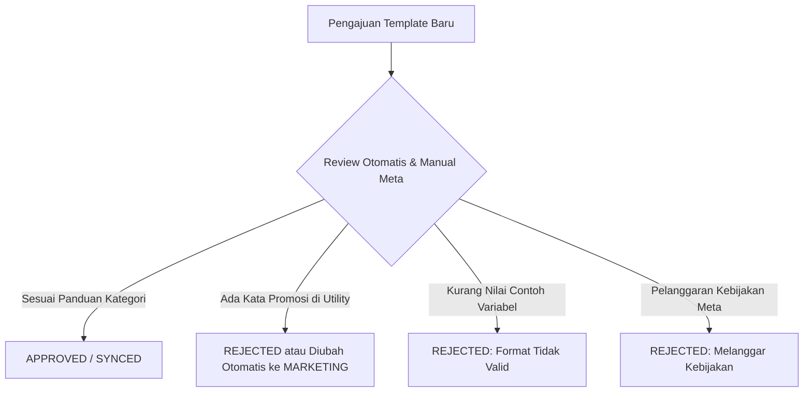
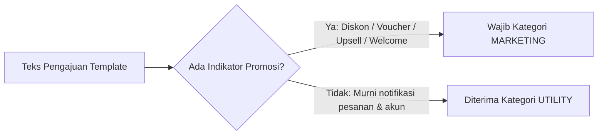

# Panduan Template Pesan WhatsApp, Perbandingan Kategori, Harga & Persetujuan Meta

Menu **Template** (`/console/whatsapp/templates`) memungkinkan bisnis untuk merancang, mengajukan, dan menyinkronkan template pesan WhatsApp yang telah disetujui secara resmi oleh Meta.



---

## 1. Perbandingan Kategori Template, Tujuan & Tarif Harga

Meta membagi template pesan WhatsApp Business ke dalam **tiga kategori utama**, masing-masing dengan tarif biaya, pengali kuota saldo, dan batasan penggunaan yang berbeda:

| Kategori | Tujuan Utama | Tarif Dasar (IDR / pesan) | Pengali Kuota | Contoh Penggunaan |
| :--- | :--- | :--- | :--- | :--- |
| **`UTILITY`** | Notifikasi transaksi spesifik yang dipicu oleh tindakan pengguna atau transaksi berjalan. | **Rp 357** | **1.0x** | Konfirmasi pesanan, nomor resi pengiriman, tagihan invoice, pengingat janji temu. |
| **`AUTHENTICATION`** | Verifikasi identitas dan keamanan akun menggunakan kode OTP (*One-Time Password*). | **Rp 357** | **1.5x** | Kode verifikasi login, reset password, autentikasi dua faktor (2FA). |
| **`MARKETING`** | Pesan promosi, pengumuman produk baru, penawaran diskon, retargeting, dan pesan sambutan. | **Rp 587** | **2.0x** | Peluncuran produk, voucher belanja, abandoned cart recovery, promo akhir bulan. |

> 💡 **Catatan Penagihan & Biaya:**
> Pengurangan kuota saldo dihitung berdasarkan negara tujuan dan tarif kategori pesan. Template `MARKETING` memiliki tarif yang lebih tinggi dibandingkan `UTILITY` dan `AUTHENTICATION`.

---

## 2. Struktur & Contoh Nyata Template Berdasarkan Kategori

### A. Contoh Template Utility (Notifikasi Transaksi)
- **Tujuan**: Memberikan informasi status transaksi atau pembaruan akun penting yang memang diminta/disetujui oleh pelanggan.
- **Aturan Ketat**: **TIDAK BOLEH** mengandung kata-kata promosi, penawaran diskon, atau rekomendasi produk lain (*upsell*).

```text
Header: [Teks: Pesanan Telah Dikirim]
Body:
Halo {{1}}, pesanan Anda dengan nomor #{{2}} telah dikirim melalui kurir {{3}}.
Nomor Resi: {{4}}
Estimasi Tiba: {{5}}.
Terima kasih telah berbelanja di toko kami.

Footer: Logistik PFNApp
Tombol:
- Quick Reply: "Cek Status Resi"
```

---

### B. Contoh Template Autentikasi (OTP / Verifikasi Akun)
- **Tujuan**: Mengirimkan kode keamanan sekali pakai untuk login, registrasi, atau konfirmasi transaksi.
- **Aturan Ketat**: Hanya boleh berisi kode OTP, batas waktu kedaluwarsa, dan peringatan keamanan. Dilarang menambahkan slogan merek, sambutan panjang, atau tombol promosi.

```text
Body:
{{1}} adalah kode verifikasi akun PFNApp Anda.
Demi keamanan, jangan berikan kode ini kepada siapa pun.
Kode berlaku selama {{2}} menit.

Footer: Peringatan Keamanan
Tombol:
- Salin Kode: "Copy Code"
- URL: "Verifikasi Login" (https://pfnapp.my.id/auth/verify?code={{1}})
```

---

### C. Contoh Template Marketing (Siaran Pesan Promosi)
- **Tujuan**: Meningkatkan penjualan, mengumumkan fitur/produk baru, atau membangun retensi pelanggan.
- **Aturan**: Mengizinkan header gambar menarik, emoji, kode voucher diskon, dan tautan belanja eksternal.

```text
Header: [Gambar: promo-gajian-banner.png]
Body:
🎉 Halo {{1}}, Promo Spesial Gajian telah dimulai!
Dapatkan diskon hingga {{2}}% untuk seluruh paket cloud hosting dan add-on WhatsApp API dengan kode voucher {{3}}.
Penawaran berlaku hingga {{4}}. Jangan sampai terlewat!

Footer: Syarat & ketentuan berlaku.
Tombol:
- Call to Action (URL): "Ambil Diskon Sekarang" (https://pfnapp.my.id/promo/gajian)
- Quick Reply: "Berhenti Menerima Promo"
```

---

## 3. Penyebab Template Ditolak Meta (dan Solusinya)

Meta mengevaluasi seluruh pengajuan template melalui algoritma AI dan peninjau manual. Berikut penyebab penolakan paling sering terjadi:

### 1. Ketidaksesuaian Kategori (Ada Konten Promosi di Utility)
- **Pemicu**: Mengajukan template sebagai `UTILITY` padahal mengandung kata seperti *"diskon"*, *"coba gratis"*, *"rekomendasi untuk Anda"*, *"cashback"*, *"kupon potongan"*, atau tautan ke halaman katalog promosi.
- **Tindakan Meta**: Ditolak langsung (`REJECTED`) atau otomatis dialihkan ke kategori `MARKETING`.
- **Solusi**: Hapus seluruh kalimat penawaran/penjualan dari teks pesan utility, atau ajukan langsung sejak awal sebagai kategori `MARKETING`.

### 2. Kurang Memberikan Contoh Nilai Variabel (*Sample Values*)
- **Pemicu**: Mendefinisikan parameter `{{1}}`, `{{2}}` tanpa memberikan contoh teks realistis saat formulir dibuat.
- **Tindakan Meta**: Ditolak karena sistem review Meta tidak dapat memahami konteks kalimat Anda.
- **Solusi**: Selalu isi kolom nilai contoh (*Sample Value*) untuk setiap variabel `{{1}}` (misal: diisi `"Budi"`).

### 3. Variabel Menggantung / Tidak Jelas
- **Pemicu**: Menempatkan variabel berurutan tanpa konteks kalimat yang jelas (contoh: `Kode Anda adalah {{1}} {{2}} {{3}}`).
- **Solusi**: Jelaskan fungsi masing-masing variabel dalam kalimat: `Kode aktivasi Anda adalah {{1}}. Berlaku selama {{2}} menit.`

### 4. Pelanggaran Kebijakan Perdagangan Meta
- **Pemicu**: Template yang mempromosikan produk terlarang (obat tanpa resep, pinjaman ilegal, judi, tembakau) atau pesan bernada ancaman palsu (*"Akun Anda akan ditutup dalam 5 menit jika tidak klik link ini"*).
- **Tindakan Meta**: Ditolak keras, dan pelanggaran berulang dapat menurunkan reputasi kualitas nomor WhatsApp Business (*Quality Rating*).

---

## 4. Indikator yang Mengubah Template Menjadi "Marketing"

Meta akan otomatis menganggap template sebagai `MARKETING` jika ditemukan **salah satu** indikator berikut:



1. **Kata Kunci Penjualan & Upsell**: Menyebut diskon, potongan harga, cashback, atau penawaran produk tambahan (*"Ingin upgrade ke paket Pro?"*).
2. **Pesan Sambutan Promotif**: Mengirim pesan pembuka yang mengarahkan pelanggan melihat-lihat katalog produk.
3. **Permintaan Ulasan & Kuesioner**: Meminta rating bintang 5 atau review Google Maps setelah transaksi selesai (*"Bagaimana pesanan Anda? Berikan ulasan di sini!"*).
4. **Aturan Konten Campuran (*Mixed Content Rule*)**: Jika pesan berisi **90% konfirmasi pesanan (Utility)** tetapi terselip **10% penawaran voucher belanja (Marketing)**, Meta **selalu mengkategorikan seluruh template tersebut sebagai MARKETING**.

---

## 5. Mengelola Template di Console


1. Buka menu **Console** > **WhatsApp** > **Templates** (`/console/whatsapp/templates`).
2. Klik tombol **"Buat Template"** untuk membuka builder template.
3. Tentukan nama template, pilih kategori yang tepat, bahasa, dan susun komponen teks beserta tombolnya.
4. Klik **Submit**. Setelah disetujui Meta, klik **"Sinkronisasi Template"** untuk memasukkan status persetujuan ke dasbor Anda.


