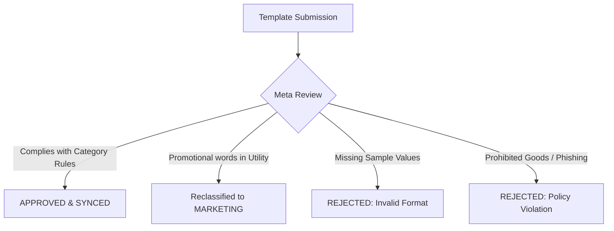

# Message Templates & Meta Approval Guide

WhatsApp Message Templates allow businesses to send proactive notifications, order updates, OTP verification codes, and marketing broadcasts to customers. Because WhatsApp protects user inboxes, **all templates must be pre-approved by Meta** before you can send them.

---

## 1. Quickstart: Create Your First Template in 3 Steps

You can design, submit, and track all templates directly from the **Console**:

1. **Open the Builder**: Navigate to **Console** > **WhatsApp** > **Templates** (`/console/whatsapp/templates`) and click **"Create Template"**.
2. **Configure Your Content**:
   - Choose a unique **Name** (e.g. `order_delivery_update`), **Category** (`UTILITY`), and **Language**.
   - Type your message body using `{{1}}`, `{{2}}` placeholders for dynamic customer data.
   - Fill in realistic **Sample Values** (e.g. `Budi`, `INV-12345`) so Meta's automated reviewer understands your message.
   - Add optional **Quick Reply** or **Call-to-Action** buttons (like _"Track Order"_ or _"Copy Code"_).
3. **Submit & Sync**: Click **Submit**. Meta usually reviews templates within seconds to a few minutes. Once approved, click **"Sync Templates"** to refresh the status in your dashboard.

---

## 2. Template Categories & Visual Examples

Meta categorizes every message template into one of three categories. Pick the category that matches your message's primary intent:

| Category             | Best For                                                  | Multiplier | Key Rule                                              |
| :------------------- | :-------------------------------------------------------- | :--------- | :---------------------------------------------------- |
| **`UTILITY`**        | Order receipts, tracking, invoices, appointment reminders | **1.0x**   | Zero promo, upsell, or discount words allowed.        |
| **`AUTHENTICATION`** | One-time passwords (OTP) & login verification             | **1.5x**   | Strict security code only. No greetings or marketing. |
| **`MARKETING`**      | Promotions, discounts, welcome messages, cart recovery    | **2.0x**   | Rich headers, emojis, promotional links allowed.      |

> 💡 **Dynamic Pricing & Country Rates:**
> Real-time per-message rates across different destination countries and currencies are managed dynamically. Inspect live rates at any time in the [**WhatsApp Pricing Table**](/console/whatsapp/pricing).

---

### A. Utility Template (Transactional Updates)

_Use for:_ Informing a customer about an ongoing transaction or account action they specifically requested.

> 📦 **Order Shipped Update**
>
> Hello **{{1}}**, your order **#{{2}}** has been dispatched via **{{3}}**.  
> **Tracking Number:** {{4}}  
> **Estimated Delivery:** {{5}}.  
> Thank you for ordering with us.
>
> _PFNApp Logistics_  
> `[🔘 Quick Reply: Track Delivery]`

---

### B. Authentication Template (Predefined Meta OTP Format)

_Use for:_ Secure identity verification via one-time passcodes (OTP).

> ⚠️ **Meta Predefined Constraint:**  
> Under official Meta WhatsApp Business API rules, **Authentication template body text cannot be customized or edited with custom sentences**. Meta mandates strict, standardized fixed wording (`<CODE> is your verification code.`) and only permits specific button types:
>
> 1. **Copy Code Button**: Adds a 1-tap clipboard copy button (`[📋 Copy Code]`).
> 2. **One-Tap / Zero-Tap Autofill (Android)**: Handshake directly with your Android app (`[⚡ Autofill App]`).

> 🔐 **Standard Authentication Message**
>
> **{{1}}** is your verification code.  
> For your security, do not share this code.  
> Valid for **{{2}}** minutes.
>
> _Security Warning: Do not share._  
> `[📋 Copy Code]` &nbsp; `[⚡ One-Tap Autofill (App)]`

### C. Marketing Template (Promotional Broadcast)

_Use for:_ Driving sales, product announcements, discount offers, or newsletters.

> 🎉 **End-of-Month Tech Sale**
>
> 🎉 Hi **{{1}}**, our End-of-Month Tech Sale is live!  
> Enjoy up to **{{2}}% OFF** on all cloud hosting plans and WhatsApp API add-ons with code **{{3}}**.  
> Offer valid until **{{4}}**. Don't miss out!
>
> _Terms & conditions apply._  
> `[🔗 Claim Discount]` &nbsp; `[🔘 Stop Promotions]`

---

## 3. Why Templates Get Rejected (and How to Fix Them)

Meta evaluates templates with AI classifiers and manual audits. If your template gets rejected or reclassified, check these 4 common triggers:

### 1. Promotional Words in a Utility Template

- **The Issue**: Submitting a template as `UTILITY` that contains words like _"discount"_, _"free trial"_, _"recommended for you"_, _"cashback"_, _"coupon"_, or promo links.
- **Meta Action**: Immediate rejection or forced reclassification into `MARKETING`.
- **The Fix**: Keep utility messages strictly factual, or submit directly as `MARKETING`.

### 2. Missing Sample Variable Values

- **The Issue**: Using variables like `{{1}}`, `{{2}}` without providing sample preview text in the form.
- **Meta Action**: Rejection because the automated reviewer cannot infer the sentence context.
- **The Fix**: Always provide clear sample values (e.g. `Budi`, `ID-9923`) in the template form.

### 3. Floating or Unanchored Variables

- **The Issue**: Putting multiple variables together without context (e.g., `Your code is {{1}} {{2}} {{3}}`).
- **The Fix**: Anchor each parameter clearly: `Your activation code is {{1}}. Expiring in {{2}} minutes.`

### 4. Prohibited Content & Scams

- **The Issue**: Mentioning unauthorized pharmaceuticals, gambling, unverified loans, or misleading threats (_"Your account will be deleted in 5 minutes unless you click here"_).
- **The Fix**: Ensure all content adheres to WhatsApp Commerce & Business Policies.

---

## 4. What Makes a Template "Marketing"?

Meta treats a template as **`MARKETING`** if **any** promotional trigger is present:

1. **Discounts & Upsells**: Any mention of sales, vouchers, coupons, or cross-selling (_"Would you also like to try our Pro tier?"_).
2. **Promotional Greetings**: Proactive welcome messages pointing to a product catalog.
3. **Surveys & Reviews**: Post-purchase requests for star ratings or Google reviews (_"How was your purchase? Rate us here!"_).
4. **Mixed Content Rule**: If a message is **90% order confirmation** and **10% promotional discount**, Meta **always classifies the entire message as MARKETING**.
