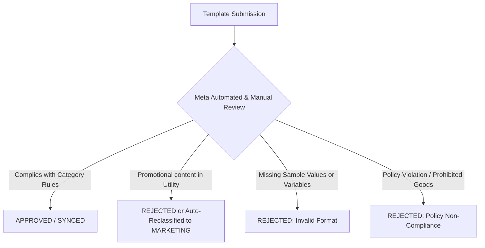
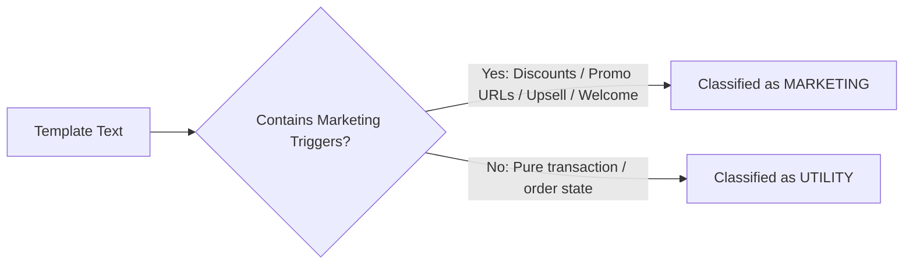

# Message Templates, Category Breakdown, Pricing & Meta Approval Guide

The **Templates** console (`/console/whatsapp/templates`) enables businesses to design, submit, and synchronize pre-approved WhatsApp message templates for customer communication.



---

## 1. Template Categories, Purpose & Quota Multiplier Comparison

Meta divides WhatsApp Business templates into **three distinct categories**, each with specific purpose scopes and quota consumption multipliers.

| Category | Primary Purpose | Quota Credit Multiplier | Example Use Cases |
| :--- | :--- | :--- | :--- |
| **`UTILITY`** | Transactional updates triggered by a specific user action or ongoing transaction. | **1.0x** | Order confirmations, shipping tracking, billing invoices, appointment reminders. |
| **`AUTHENTICATION`** | Secure identity verification via one-time passcodes (OTP). | **1.5x** | Account verification codes, password resets, multi-factor authentication (MFA). |
| **`MARKETING`** | Promotional messaging, announcements, upsells, retargeting, and offers. | **2.0x** | Product launches, discount vouchers, abandoned cart recovery, seasonal campaigns. |

> 💡 **Pricing & Live Rates:**
> Real-time per-message rates across different destination countries and currency rates are managed dynamically. You can inspect live rates at any time in the console at [**WhatsApp Pricing Table**](/console/whatsapp/pricing).

## 2. Template Structure & Real-World Examples by Category

### A. Utility Template Example (Transactional Update)
- **Purpose**: Inform a customer about an ongoing transaction or account state that they specifically requested or agreed to receive.
- **Rule**: Must **NOT** contain any promotional language, discount vouchers, or upsell recommendations.

```text
Header: [None or Text: Order Shipped]
Body:
Hello {{1}}, your order #{{2}} has been dispatched via {{3}}. 
Tracking Number: {{4}}
Estimated Delivery: {{5}}.
Thank you for ordering with us.

Footer: PFNApp Logistics
Buttons:
- Quick Reply: "Track Delivery"
```

---

### B. Authentication Template Example (One-Time Password / OTP)
- **Purpose**: Authenticate user login, registration, or transaction confirmation.
- **Rule**: Must only deliver the code, expiration time, and security warning. No greeting text, branding slogans, or marketing CTAs allowed.

```text
Body:
{{1}} is your verification code for PFNApp. 
For security reasons, do not share this code with anyone. 
Valid for {{2}} minutes.

Footer: Security Alert
Buttons:
- Copy Code: "Copy Code"
- URL: "Verify Login" (https://pfnapp.my.id/auth/verify?code={{1}})
```

---

### C. Marketing Template Example (Promotional Broadcast)
- **Purpose**: Drive awareness, increase engagement, announce new features, or generate sales.
- **Rule**: Allows rich promotional headers, emojis, discount codes, and external website links.

```text
Header: [Image: seasonal-sale-banner.png]
Body:
🎉 Hi {{1}}, our End-of-Month Tech Sale is live!
Enjoy up to {{2}}% OFF on all cloud hosting plans and WhatsApp API add-ons with code {{3}}.
Offer valid until {{4}}. Don't miss out!

Footer: Terms & conditions apply.
Buttons:
- Call to Action (URL): "Claim Discount" (https://pfnapp.my.id/promo/tech-sale)
- Quick Reply: "Stop Promotions"
```

---

## 3. Why Templates Get Rejected (and How to Fix Them)

Meta reviews all templates through automated AI classifiers and human reviewers. The most common rejection causes are:

### 1. Category Mismatch (Promotional Content in Utility)
- **The Trigger**: Submitting a template as `UTILITY` that contains words like *"discount"*, *"free trial"*, *"recommended for you"*, *"cashback"*, *"coupon"*, or links leading to promotional landing pages.
- **Meta Action**: Immediate rejection (`REJECTED`) or forced reclassification into `MARKETING`.
- **The Fix**: Remove all sales/upsell wording from utility messages or submit directly under the `MARKETING` category.

### 2. Missing Sample Variable Values
- **The Trigger**: Defining parameters `{{1}}`, `{{2}}` without providing representative sample text (e.g., submitting `Hello {{1}}` without sample value `Budi`).
- **Meta Action**: Rejected due to inability to evaluate message context.
- **The Fix**: Always provide clear sample values during creation in the template builder.

### 3. Vague or Generic Parameters
- **The Trigger**: Using floating parameters without context (e.g., `Your code is {{1}} {{2}} {{3}}`).
- **The Fix**: Anchor parameters clearly in the sentence: `Your activation code is {{1}}. Expiring in {{2}} minutes.`

### 4. Policy Violations (Prohibited Goods & Misleading Information)
- **The Trigger**: Templates mentioning gambling, adult services, prohibited supplements, unverified loans, or misleading threats (e.g., *"Your account will be deleted in 5 minutes unless you click here"*).
- **Meta Action**: Rejected, and repeated violations can trigger WhatsApp Business Account quality penalties.

---

## 4. What Makes a Template "Marketing"? (Classification Indicators)

Meta classifies a template as `MARKETING` whenever **any** of the following indicators are detected:



1. **Promotional Offers & Upsells**: Any mention of discounts, sales, coupons, cashback, or cross-selling products (*"Would you also like to try our Pro tier?"*).
2. **Generic Greetings & Welcome Messages**: Proactive introductory messages (*"Welcome to our store! Check out our top products."*).
3. **Survey & Review Requests**: Post-purchase requests for star ratings or Google reviews (*"How was your purchase? Rate us here!"*).
4. **Interactive Shopping Buttons**: Buttons directing users to product catalogs or promo pages.
5. **Mixed Content Rule**: If a single message contains **90% order confirmation (Utility)** and **10% discount promo (Marketing)**, Meta **always treats the entire template as MARKETING**.

---

## 5. Managing Templates in Console


1. Navigate to **Console** > **WhatsApp** > **Templates** (`/console/whatsapp/templates`).
2. Click **"Create Template"** to open the builder.
3. Fill in name, category, language, and components.
4. Click **Submit**. Once approved by Meta, click **"Sync Templates"** to pull the status into your dashboard.


