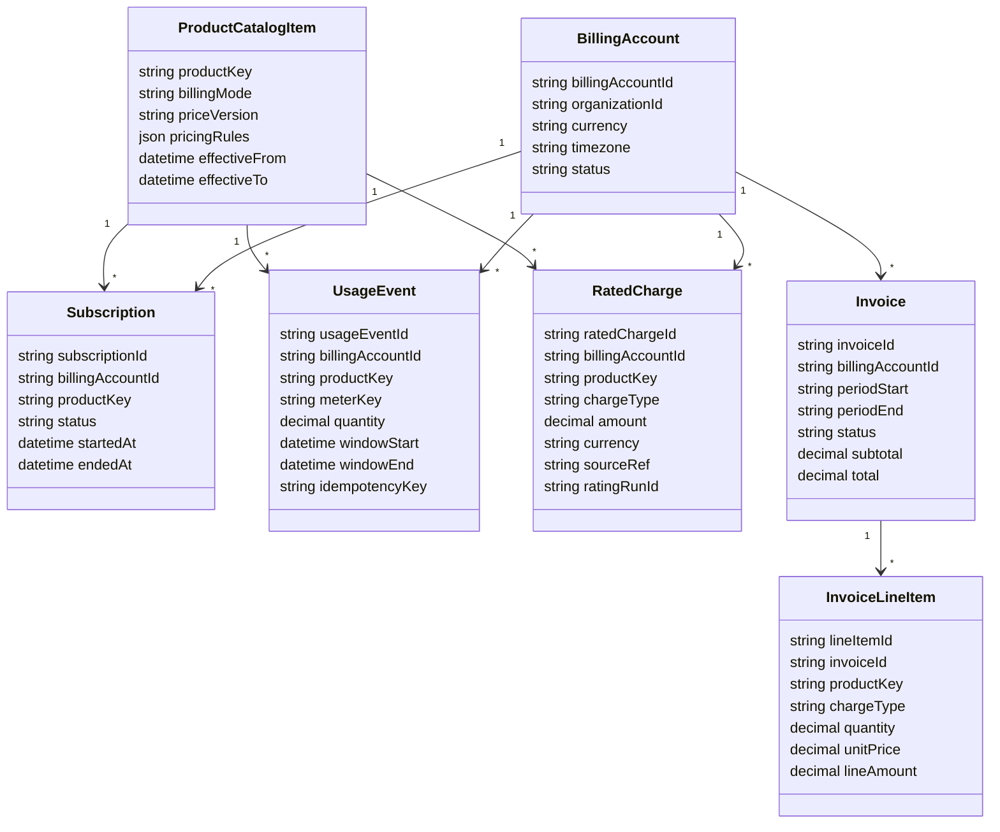
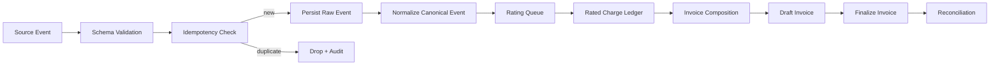

# Unified Billing Foundation Architecture and ADR

## Context
We need one billing foundation for three pricing modes under a single invoice:
- App hosting: pay-per-hour with a monthly cap
- VPN: monthly flat subscription
- Future add-ons: recurring, usage, or hybrid

Current scope is architecture and domain contract definition, not full runtime
implementation.

## Goal
Define an implementation-ready billing architecture and domain contract that
unifies catalog, metering, rating, invoicing, and reconciliation across all
products, with clear boundaries and ADR-level decisions for rollout.

## Scope of work
1. Define architecture layers, components, boundaries, and ownership.
2. Define canonical billing modes and pricing/rating behavior.
3. Define event lifecycle and idempotency strategy for usage/subscription
   events.
4. Define single-invoice composition rules for mixed product charges.
5. Record decisions, assumptions, out-of-scope items, risks, and rollout
   phases.

## Architecture
### Layered billing architecture

```text
Product Surfaces (console/portal APIs)
  -> Billing Catalog Service
  -> Metering Ingestion Service
  -> Subscription Service
  -> Rating Engine
  -> Invoice Composer
  -> Reconciliation + Adjustments
  -> Invoice API + Export
```

### Component boundaries and ownership
| Component | Owns | Does not own | Interface contract |
| --- | --- | --- | --- |
| Catalog Service | Product definitions, price plans, billing mode metadata, price versioning | Runtime usage data, invoice generation | Read-only pricing lookups by `productKey + priceVersion` |
| Metering Ingestion | Raw usage events, dedupe status, normalized meter events | Price lookup, final invoice totals | `UsageRecorded` canonical event stream |
| Subscription Service | Subscription lifecycle states for monthly products | Meter ingestion internals | `SubscriptionActivated/Changed/Canceled` events |
| Rating Engine | Rated charges, cap application, adjustment deltas | Final invoice numbering, payment collection | `RatedCharge` records by billing period |
| Invoice Composer | Invoice document assembly and line ordering | Raw event normalization | Draft/final invoice projections |
| Reconciliation Service | Cross-system consistency checks and adjustment requests | Product catalog updates | Reconciliation reports + `AdjustmentRequested` |

### Data ownership model
- Billing account (`billingAccountId`) is the invoice boundary.
- `organizationId` maps to one billing account in phase 1.
- Raw events are immutable.
- Rated charges are versioned by re-rating run.
- Final invoices are immutable; corrections are credits/debits on future
  invoices.

## Canonical domain contract

### Billing modes
| Mode | Product example | Charge driver | Billing period | Key rule |
| --- | --- | --- | --- | --- |
| `hourly_capped` | `app_hosting` | Usage hours from meter | Calendar month | Sum(hourly charges) capped at monthly max |
| `monthly_flat` | `vpn` | Active subscription | Calendar month | One recurring charge per active period |
| `hybrid` | `addon_*` | Recurring base + usage meters | Calendar month | Compose recurring + usage into same invoice |

### Core entities



### Canonical event envelope
```json
{
  "eventId": "evt_01J...",
  "eventType": "usage.recorded",
  "eventVersion": 1,
  "occurredAt": "2026-05-21T08:00:00Z",
  "effectiveAt": "2026-05-21T08:00:00Z",
  "source": "app-runtime-meter",
  "organizationId": "org_123",
  "billingAccountId": "ba_123",
  "productKey": "app_hosting",
  "idempotencyKey": "app-runtime-meter:clusterA:pod123:2026-05-21T08",
  "payload": {}
}
```

## Rating and pricing rules

### `app_hosting` (`hourly_capped`)
- Meter key: `runtime_hours`.
- Rating formula: `hourlyRate * billableHours`.
- Cap scope: per `billingAccountId + appId + month`.
- Cap rule: when month-to-date rated amount exceeds `monthlyCap`, set additional
  charge for that app to `0` for remaining hours in the month.
- Line item output:
  - Usage line for billable hours before cap.
  - Cap adjustment line when cap boundary is crossed (negative adjustment to
    keep total at cap).

### `vpn` (`monthly_flat`)
- Subscription-driven recurring charge.
- Charge once per active month per VPN subscription.
- Phase 1 proration rule: no mid-cycle proration. Start/cancel changes take
  effect next billing month.

### `addon` (`hybrid`)
- Optional recurring base fee + optional usage meter charges.
- Uses the same invoice period and invoice document as core products.
- Must declare one or both of:
  - `recurringComponent`
  - `usageComponents[]`

## Event lifecycle and idempotency

### Lifecycle



### Idempotency strategy
- All producer events must include `idempotencyKey`.
- Consumer dedupe store: unique constraint on `(eventType, idempotencyKey)`.
- Processing model: at-least-once delivery with exactly-once effect at
  persistence boundary.
- Replays allowed: replay keeps same `eventId` and `idempotencyKey`.
- Expiry: dedupe records retained for 18 months to cover invoice dispute window.

### Late and corrective events
- Late usage accepted up to `billingPeriod + 7 days` into grace window.
- If invoice already finalized:
  - Create `adjustment` rated charge in current open period.
  - Link `sourceInvoiceId` for audit trail.

## Invoice composition rules

### Single-invoice aggregation contract
For each `billingAccountId + billingMonth + currency` generate exactly one
invoice document.

### Composition order
1. Recurring charges (`monthly_flat`, recurring `hybrid`).
2. Usage charges (`hourly_capped`, usage `hybrid`).
3. Adjustments/credits/debits.
4. Taxes/discounts (phase 2, out of current scope).

### Grouping and display
- Group by product family: App Hosting, VPN, Add-ons.
- Preserve line-level provenance with `sourceRef` to subscription or usage batch.
- Currency must be uniform per invoice in phase 1.

### Invoice invariants
- One open draft invoice per account per month.
- Finalized invoice is immutable.
- Invoice total equals sum of line items and adjustments.
- No orphan line item without rated charge provenance.

## Reconciliation model
- Daily checks:
  - Metered quantity vs rated quantity by `productKey + meterKey`.
  - Rated subtotal vs draft invoice subtotal.
  - Finalized invoice totals vs exported accounting totals.
- Mismatch policy:
  - Severity `high`: block finalization.
  - Severity `medium/low`: finalize allowed with flagged follow-up adjustment.

## ADR decision log

### ADR-001: Single invoice per billing account per month
- Status: accepted for phase 1.
- Decision: one invoice across app hosting, VPN, and add-ons.
- Rationale: simpler customer billing experience and payment reconciliation.

### ADR-002: Hybrid event-driven billing pipeline
- Status: accepted for phase 1.
- Decision: streaming ingestion + scheduled monthly finalization.
- Rationale: supports near-real-time visibility without requiring real-time
  invoice finalization.

### ADR-003: Cap applied during rating, not invoicing
- Status: accepted for phase 1.
- Decision: `hourly_capped` cap logic in rating engine.
- Rationale: keeps invoice composer deterministic and mode-agnostic.

### ADR-004: Immutable finalized invoices, compensating adjustments only
- Status: accepted for phase 1.
- Decision: no mutation of finalized invoices.
- Rationale: auditability and accounting safety.

### ADR-005: Simplified month boundaries for phase 1
- Status: accepted for phase 1.
- Decision: calendar-month billing, no proration for VPN in phase 1.
- Rationale: faster rollout and lower implementation risk.

## Assumptions
- One `organizationId` maps to one `billingAccountId` in phase 1.
- Currency is fixed per billing account in phase 1.
- Usage timestamps are UTC and normalized before rating.
- Product catalog versioning is available before metering rollout.

## Out of scope (phase 1)
- Payment collection and dunning workflows.
- Tax engine integration and jurisdictional tax handling.
- Coupon/discount engine.
- Multi-currency invoices per billing account.
- Back-billing older than 18 months.

## Risks and mitigations
| Risk | Impact | Mitigation |
| --- | --- | --- |
| Missing or delayed meter events | Under/over-billing | Reconciliation checks + late adjustment flow |
| Duplicate producer events | Double charging | Hard unique dedupe on idempotency key |
| Catalog misconfiguration | Incorrect rating | Price version validation and contract tests |
| Cap boundary race conditions | Cap overshoot | Atomic month-to-date cap accumulator per app |
| Ambiguous ownership between services | Delivery delays | Explicit component ownership table |

## Phased rollout guidance
- Phase 0 (foundation): catalog schema, canonical events, dedupe store,
  rated charge ledger.
- Phase 1 (MVP billing): app hosting `hourly_capped`, VPN `monthly_flat`,
  single invoice output.
- Phase 2 (expansion): add-on `hybrid`, taxes/discounts, proration rules,
  accounting export hardening.
- Phase 3 (scale): multi-currency per org, advanced dispute workflows,
  anomaly detection.

## Implementation mapping (for Kanban task slicing)
1. Catalog contracts
   - Define `ProductCatalogItem` schema and `billingMode` constraints.
2. Metering + subscription events
   - Implement canonical envelope and dedupe persistence.
3. Rating engine
   - Implement `hourly_capped` and `monthly_flat` calculators.
4. Invoice composer
   - Implement single-invoice aggregation and line grouping.
5. Reconciliation + adjustments
   - Implement mismatch detection and compensation flow.

## Validation summary
- Artifact consistency check: complete.
- Architecture acceptance criteria coverage: complete.
- Ambiguity check against implementation mapping: complete.
- `bun run lint`: passed with existing repository warnings (0 errors, 40
  warnings, unrelated to this document change).
- `bun run typecheck`: not run (no typed code/config touched).

## Review outcomes
- Product review: pending stakeholder sign-off.
- Engineering review: pending stakeholder sign-off.
- Implementation readiness: ready for task decomposition after sign-off.

## Deliverables
- Billing architecture/ADR document: this file.
- Domain model and workflows: `Core entities`, `Event lifecycle and
  idempotency`, and Mermaid diagrams.
- Decision log and rollout guidance: `ADR decision log` and `Phased rollout
  guidance`.
- Validation and review summary: `Validation summary` and `Review outcomes`.
